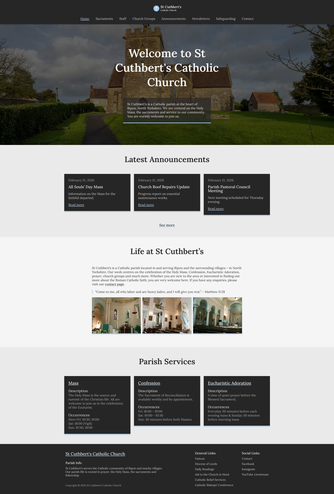
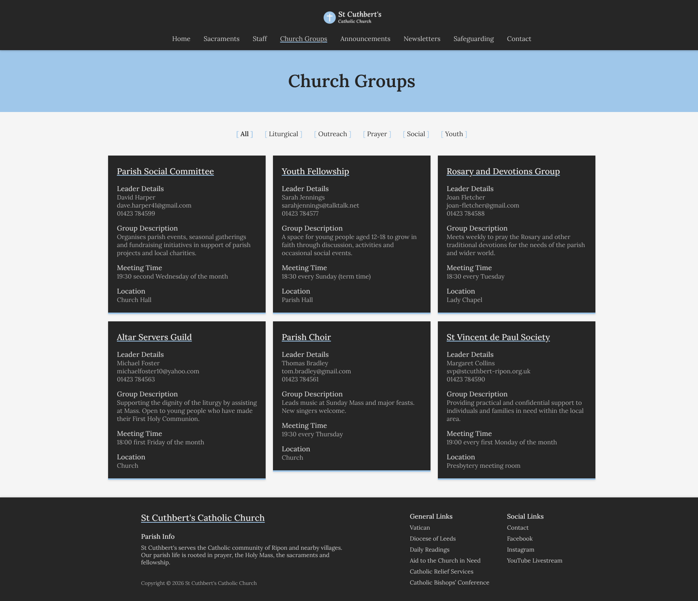
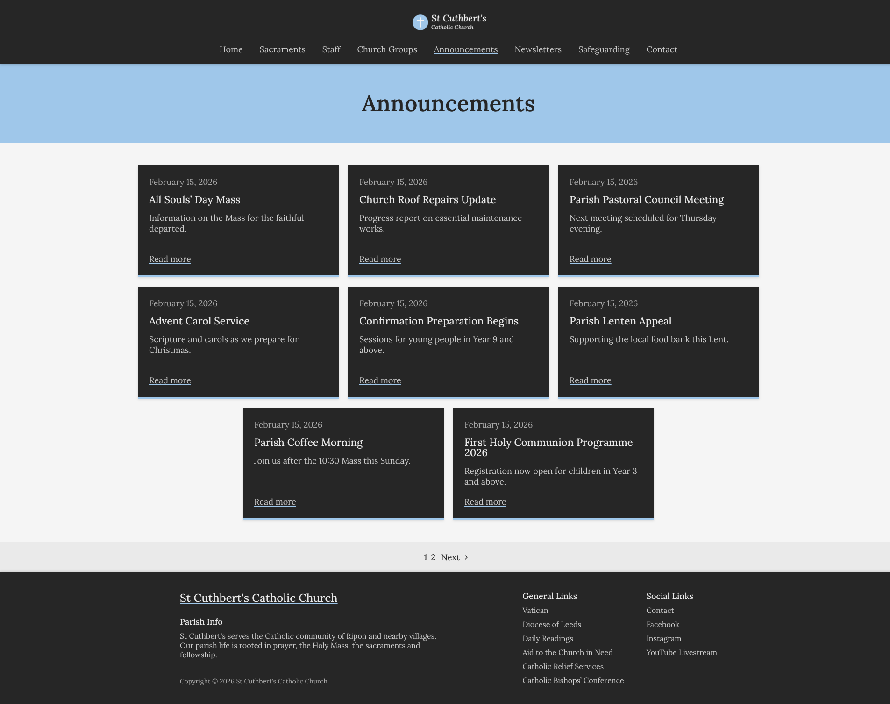
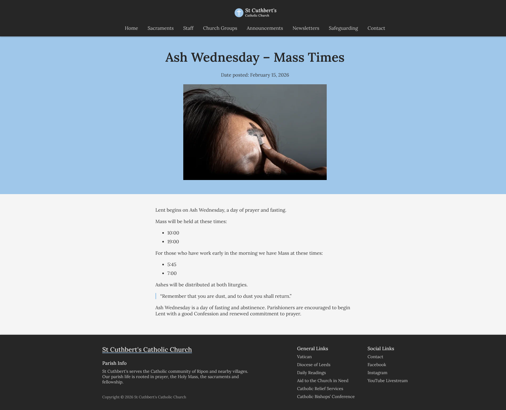
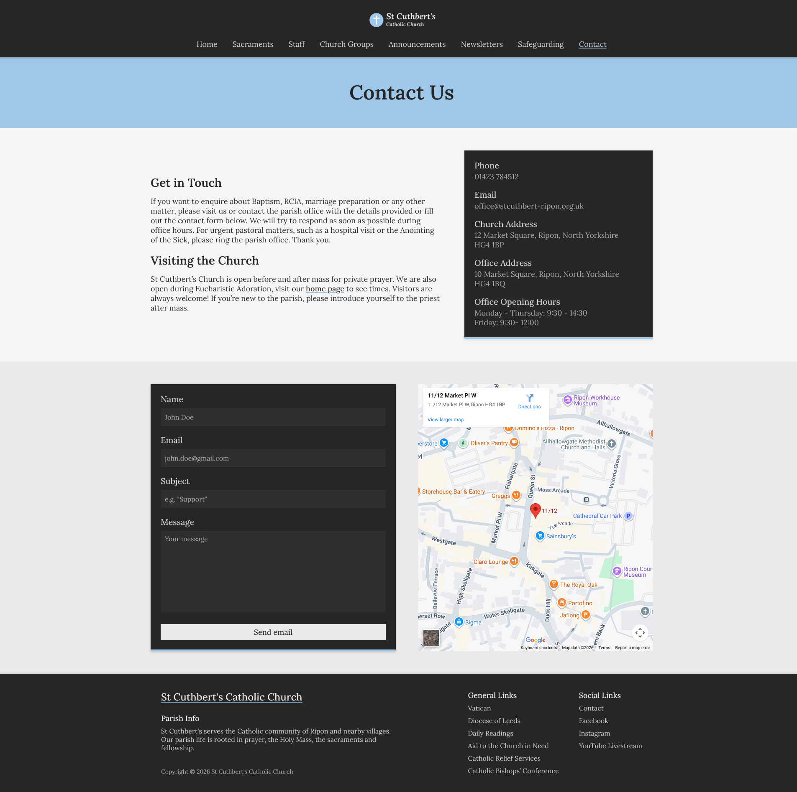
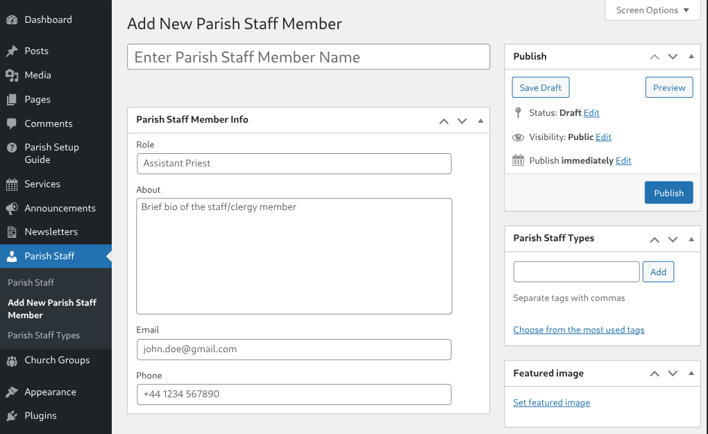
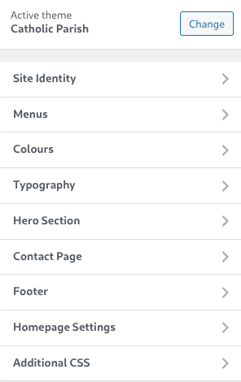
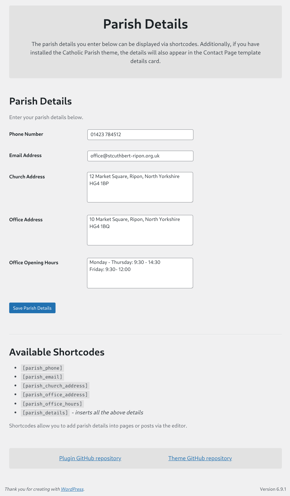
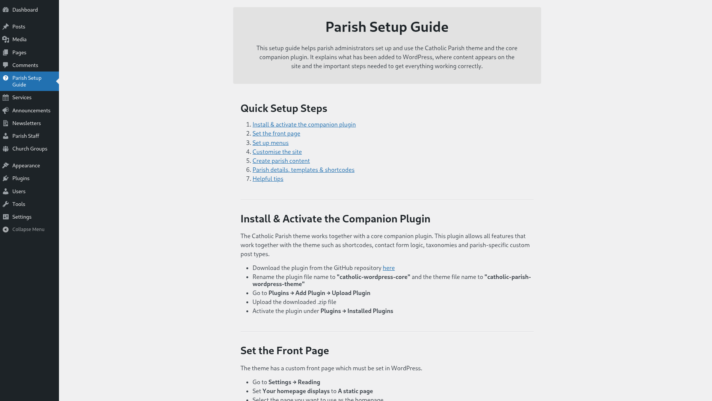

# 🎨 Catholic Parish WordPress Theme

A **custom WordPress classic theme** built for Catholic parishes. Designed with clarity, accessibility and structured parish content in mind.

To follow WordPress best practices, I have separated presentation (theme) from core functionality (companion plugin).

🔌 Companion Plugin:
👉 [https://github.com/jamiewilliamsxyz/catholic-parish-core](https://github.com/jamiewilliamsxyz/catholic-parish-core)

## Previews

### 💻 Demo Site

👉 [Catholic Parish demo site _- coming soon_]()

### 🖼️ Demo Site & Admin Dashboard Screenshots

👉 [Screenshots](https://github.com/jamiewilliamsxyz/catholic-parish-wordpress-theme/tree/main?tab=readme-ov-file#%EF%B8%8F-screenshots)

## 📌 Project Overview

Many Catholic parish websites use WordPress but have these problems:

- Inconsistent design
- Poor content structure
- Excessive flexibility leading to clutter
- Lack of technical best practices
- Security vulnerabilities

Catholic Parish theme and core plugin were built to:

- Prioritise **clarity over excessive flexibility**
- Give structured, parish specific content types
- Follow **WordPress architecture standards**
- Help non-technical parish admins, secretaries and volunteers

The project consists of:

- 🎨 A classic WordPress theme built from scratch (presentation layer)
- 🔌 A companion plugin (core functionality layer)

Originally the plugin features were registered in the theme. I later separated it out for content portability if the user decides to switch themes.

## 🚀 Features

### 🎨 Theme Features

#### Front Page

- **Hero section** (customisable via Customizer)
- **Latest announcements** (pulls from Announcement CPT)
- **Content section** (editable via the page editor)
- **Services section** (pulls from Service CPT)

#### Menus

- Primary navigation menu
- Footer general links menu
- Footer social links menu

#### Custom JavaScript

- Mobile hamburger menu with a toggle
- Scroll triggered card animations for the front page

#### Customizer Options

- 🎨 Accent colour
- 🔤 Typography controls
- 🖼 Hero title, text and background image
- 🗺 Google Maps embed (for the Contact Page template)
- 📝 Footer title, description and copyright text

#### Contact Page Template

- Content section
- Parish details card (data pulled from the plugin)
- Custom contact form
- Google Map embed

#### Custom Post Type Features

- Custom content for each CPT
- Pagination template part for CPT archives
- Taxonomy term filtering for relevant CPTs archives

#### Admin Experience

- Parish Setup Guide admin page (onboarding for non-technical users)
- Conditional admin notice if the companion plugin is missing

#### Security

- Input sanitisation and output escaping
- Capability checks

#### Other

- Fully responsive design (mobile-first)
- Fully translatable with `.pot` file, textdomain and i18n functions
- Reusable template parts

### 🔌 Plugin Features

#### Custom Post Types

- Announcement
- Service
- Newsletter
- Parish Staff
- Church Group

#### Custom Taxonomies

- Parish Staff Type taxonomy
- Church Group taxonomy

#### Meta Boxes

- Custom meta boxe fields for each CPT
- Dynamic "Add post" placeholder text modifications depending on CPT

#### Content Enhancements

- Contact form handling (secure with nonce verification)
- Shortcodes:
  - `[parish_phone]`
  - `[parish_email]`
  - `[parish_church_address]`
  - `[parish_office_address]`
  - `[parish_office_hours]`
  - `[parish_details]`

#### Parish Details Settings Page

Build using the WordPress Settings and Options APIs:

- Phone
- Email
- Church Address
- Office Address
- Office Opening Hours

#### Security

- Input sanitisation
- Output escaping
- Nonce verification (for Meta Boxes and contact form)
- Capability checks

#### Other

- Conditional admin notice if the theme is missing
- Fully translatable with `.pot` file, textdomain and i18n functions

## 🧰 Tech Stack

  
  
  

### Development Tools

- `Figma` (designing and prototyping)
- `Local` (local WordPress development environment)
- `Git & GitHub` (version control and repository management)
- `VS Code` (code editor)

## 📥 Installation

### Theme

1. Download this repository
2. Rename the folder to `catholic-parish-wordpress-theme`
3. Upload to WordPress themes
4. Activate the theme via WordPress

### Plugin

1. Download here: [https://github.com/jamiewilliamsxyz/catholic-parish-core](https://github.com/jamiewilliamsxyz/catholic-parish-core)
2. Rename the folder to `catholic-parish-core`
3. Upload to WordPress plugins
4. Activate the plugin via WordPress

## 📚 What I learned

This was my first complete WordPress theme + plugin project with the goal being to deepen my understanding of WordPress development.

### 🔐 Contact Form & Meta Box Input Handling

- **Security & Data Handling:** Developing the contact form handling and custom metaboxes meant I had to properly sanitise, validate and escape user input. I learned how to use nonces for verification and handle data securely

### 🔌 Extracting Functionality Into Companion Plugin

- **Architectural Thinking:** Originally I had CPT, shortcodes, taxonomies, Meta Boxes and contact form logic inside the theme. Refactoring them into the plugin helped me to understand content portability and separation of concerns

### 🖥 Creating a Setup Guide Page & Admin Notices

- **Practical UX Thinking:** I had to think about my target audience and their level of technical knowledge to create a theme and plugin that could be implemented and set up smoothly. That's why I created admin notices to warn the user if the theme or plugin is not active and why I created a detailed parish setup guide admin page. This forced me to think like a user which improved my practical UX thinking

### ⚙️ Using WordPress APIs

- **System-Level Understanding:** Working with the different WordPress APIs like the Settings API, Options API and the Customizer API taught me how WordPress structures data internally. I learned how to handle these APIs to create a functional theme and plugin

## 🔮 Future Improvements

- **Refactor CSS Into Scalable Architecture:** Implement a more structured system such as BEM to improve maintainability
- **Improve Contact Form:** Allow users to choose an email to send the form submissions instead of it only being sent to the site admin
- **Expand Shortcodes:** Add more shortcodes and turn some components such as the Google Map embed into one
- **Add More Site Customisation Options:** Add primary and secondary colour options as well as options for layout

## 🖼️ Screenshots

### Front Page - Desktop View

### Front Page - Mobile View

### Church Group Archive - CPT Archive With Taxonomy Terms Filter

### Announcement Archive - CPT Archive With Pagination

### Announcement Post - CPT Post

### Contact Page Template - Map Embed & Secure Contact Form

### Add Parish Staff - Custom Post Type Admin UI

### Customizer - Custom Sections

### Parish Details - Custom Settings Page

### Parish Setup Guide - Custom Admin Onboarding Page

